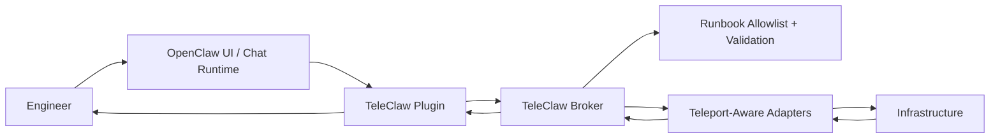

# TeleClaw

TeleClaw is a production-ready template for OpenClaw agents that use Teleport as the infrastructure identity and access plane.

AI agents should not execute raw infrastructure commands with static credentials. TeleClaw provides a safer pattern:

1. OpenClaw handles chat and agent experience.
2. A TeleClaw plugin sends typed requests to a local broker.
3. The broker enforces an allowlisted runbook manifest and read-only policy.
4. Teleport provides authenticated infrastructure access and auditing.

Without strong enforcement, agent-driven operations can become shell-injection-prone, opaque, and credential-heavy. TeleClaw shifts execution to broker-managed, manifest-defined runbooks and keeps secrets out of agent runtime.

## Architecture



## Responsibilities

- OpenClaw: UI/chat runtime, tool orchestration, user intent handling.
- Teleport: infrastructure identity, access policy, session auditing.
- TeleClaw: strongly typed runbook contract, policy enforcement, redaction, and summarized results.

## Repository Structure

- `openclaw-plugin/`: TypeScript plugin with `list_runbooks`, `run_runbook`, `get_runbook_status` tools.
- `broker/`: Go HTTP broker, manifest loader, job store, runner, adapters, redaction, summaries.
- `runbooks/`: committed runbook examples (`*.example.yaml`) only.
- `teleport/`: example Teleport roles and config placeholders.
- `docs/`: architecture, threat model, quickstart, integrations, conventions.
- `scripts/`: bootstrap, copy examples, validation checks.

## Example Workflow

1. Engineer asks OpenClaw: "Diagnose release status in namespace `payments`."
2. Plugin calls `run_runbook` with `runbook_id: k8s.release_diagnose`.
3. Broker validates manifest + inputs and enqueues execution.
4. Adapter runs read-only checks through Teleport-authenticated path.
5. Broker redacts sensitive patterns, stores structured output, and returns summary.
6. Engineer inspects details with `get_runbook_status` / `jobs/{id}/logs`.

## Template File Conventions

Everything committed as a starter config/runbook/env must be `.example`.

- committed: `runbooks/ssh/host_diagnose.example.yaml`
- local working copy: `runbooks/ssh/host_diagnose.yaml` (gitignored)

Use this command after cloning:

```bash
make copy-examples
```

## Setup Overview

```bash
make setup
make copy-examples
```

## Local Development

Terminal 1:

```bash
make broker
```

Terminal 2:

```bash
make plugin
```

Health check:

```bash
curl http://127.0.0.1:8080/healthz
```

## Add New Runbooks

1. Add `runbooks/<kind>/<id>.example.yaml`.
2. Map `kind` to an adapter implementation in `broker/internal/runner`.
3. Validate with `make validate-runbooks`.
4. Create local copy via `make copy-examples`.
5. For live Teleport-backed Kubernetes runs, use local runbook copy with `execution.provider: teleport`.

## Roadmap

1. Teleport-backed adapter implementations (`tsh`, workload identity, signed workload joins).
2. SQLite-backed durable store with retention policies.
3. Fine-grained input policies per runbook and role.
4. Signed runbook bundles and CI validation gates.

## License

MIT (see `LICENSE`).
